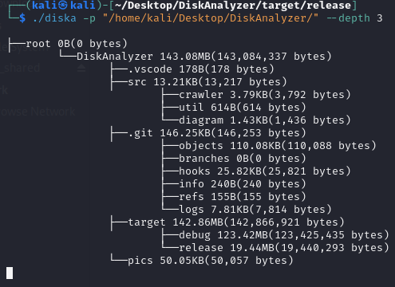
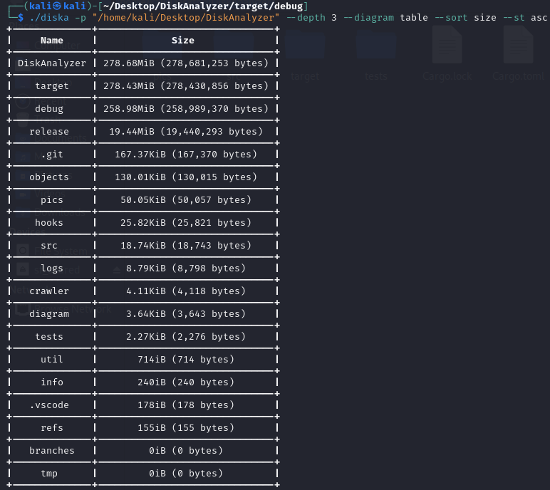

# DiskAnalyzer

## Description

Check Folder Size And Create Diagram Based On Their Size




## Note:

- Project May Not Work On Some Of System Folders Due To Lack Of Permissions (Access Denied)
- This Project Works On Windows And Linux Only
- Args Are Case-Insensetive

## How To Use :

```

get information about size of folders in each drive

Usage: diska [OPTIONS]

Options:
      --depth <depth>      how many level of inner directories should it scan
      --diagram <diagram>  Set Diagram Types : tree , table
  -s, --sort <sort>        Sort Folders Based On Given Value : size , name

      --st <st>            Can Use By sort
                           Sort Folders:  Desc or Asc
  -p, --path <path>        analyze give path
  -h, --help               Print help
  -V, --version            Print version


```

## How To Install :

```
Download And Install Cargo (Rust Package Manager)
Run Following Command in Terminal
cargo install DiskAnalyzer
```

## ToDO List :

- [x] Add Depth For Folder Crawler
- [x] Add More Diagrams
- [ ] Add Mac Support (Currently It Supports Windows And Linux)
- [x] Implement Sorting
- [ ] Handle Files In Terminal (Add Move , etc)
- [ ] List File Types (Audio , Video , etc)
